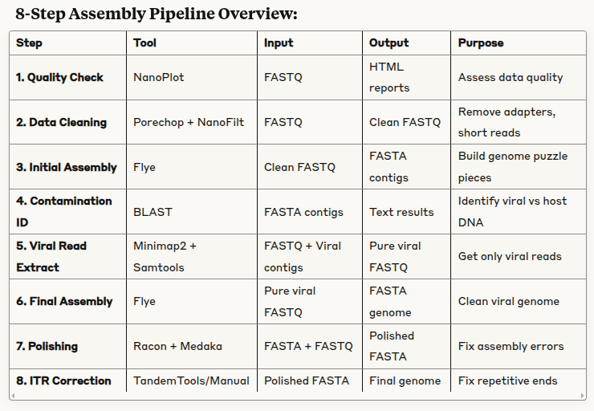

whole genome assembly of ORVF genome
8 samples in total
two different conditions (4 samples each): wt vs modified ORV

microsynth nanopore sequencing (md5 download OK)
provide fastq files and did some pre-filtering and QC reporting

process samples separately and see how it goes. if i need more
depth i can combine the 4 samples of each condition

1. quality control
2. data filtering
3. initial assembly
4. contamination detection (blast)
5. filter reads
6. clean assembly
7. assembly polishing
8. ITR handling

quality control of samples (done by microsynth, I want to generate one
big csv for easy comparison between samples))

data filtering (partly done by microsynth)
will 